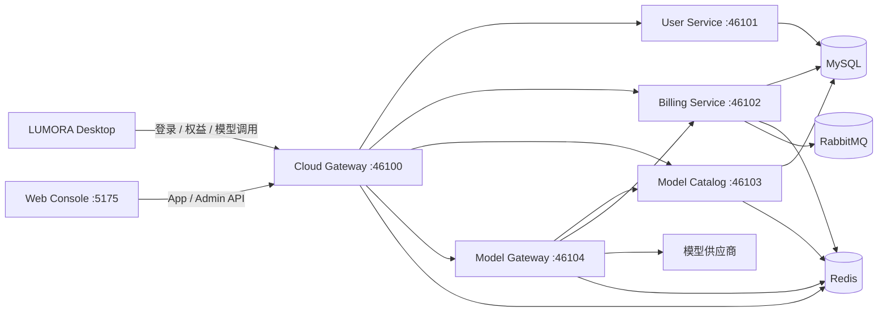

<h1 align="center">Lumora Cloud</h1>

<p align="center">为 LUMORA Desktop 提供账户、套餐计费和托管模型能力的云端平台</p>

<p align="center">
  
  
  
  
</p>

Lumora Cloud 与 [LUMORA Desktop](https://github.com/fkwhao/LUMORA) 独立部署。Desktop 负责本地 Agent
体验和 BYOK，Cloud 负责身份、套餐、钱包、模型目录、托管调用及权威 Usage 结算。用户购买和管理
交易统一在网页控制台完成。

> **项目状态：持续开发中。** 认证、套餐、额度、钱包、订单、模型发布、多供应商路由、流式协议、
> 分布式限流、结算恢复和运营管理链路已经实现；真实第三方支付渠道仍待接入。

## 核心能力

| 领域 | 当前实现 |
| --- | --- |
| 账户与会话 | 注册登录、Refresh Token 轮换、设备会话、角色、审计和会话撤销 |
| 套餐与计费 | 套餐版本、顺延订阅、七天额度周期、预占/结算/释放和不可变账本 |
| 钱包与订单 | 多币种钱包、充值、钱包购买、幂等订单和开发环境 MOCK 支付 |
| 模型目录 | 供应商、加密凭据、模型草稿、不可变发布版本、能力与时段费率 |
| 模型网关 | Chat Completions、Responses、Anthropic Messages、SSE 和托管 Web Search |
| 可靠性 | Redis 并发与限流、请求租约、Sentinel 熔断、RabbitMQ 延迟过期和结算恢复 |
| 运营端 | 用户、套餐、钱包、订单、模型、供应商、Usage、诊断和对账工作台 |

## 系统架构



### 工程结构

```text
LUMORA_CLOUD/
├── backend/                    # Java 21 / Spring Cloud Maven 多模块工程
│   ├── cloud-common/           # 稳定公共能力
│   ├── cloud-api/              # Feign Client 与跨服务契约
│   ├── cloud-gateway/          # API 入口与可信身份上下文
│   ├── user-service/           # 用户、会话与角色
│   ├── billing-service/        # 套餐、钱包、额度与结算
│   ├── model-catalog-service/  # 供应商、模型与发布配置
│   └── model-gateway-service/  # 托管模型代理与结算编排
├── frontend/                   # React/Vite 用户控制台与管理端
├── deploy/                     # 中间件 Compose、Nacos 与 Sentinel 配置
└── docs/                       # 平台架构和领域设计
```

### 服务端口

| 服务 | 默认端口 | 职责 |
| --- | ---: | --- |
| Cloud Gateway | `46100` | 统一入口、JWT 校验、身份头注入和粗粒度流控 |
| User Service | `46101` | 登录、设备会话、角色和审计 |
| Billing Service | `46102` | 套餐、订单、钱包、额度、Usage 和账本 |
| Model Catalog Service | `46103` | 模型目录、版本、凭据和计价配置 |
| Model Gateway Service | `46104` | 上游路由、流式协议、限流和权威结算 |
| Web Console | `5175` | 用户控制台与运营管理端 |

## 数据与中间件

| 组件 | 责任 |
| --- | --- |
| MySQL | 用户、套餐、订阅、钱包、账本和模型发布版本的最终事实来源 |
| Redis | 会话撤销、模型与套餐 Cache Aside、并发信号量、限流、租约和短期诊断 |
| RabbitMQ | 购买及充值订单的延迟过期消息；MySQL 扫描负责兜底 |
| Nacos | 服务发现和开发环境集中配置 |
| Sentinel | HTTP 流控、服务调用熔断和动态上游路由保护 |

套餐缓存包含最新已发布套餐列表、按版本查询的详情及模型权限，默认 TTL 为 5 分钟。套餐或版本写入
成功后切换缓存代次；订阅状态、剩余额度、预占和结算始终读取 MySQL 权威数据。

## 用户入口

| 页面 | 功能 |
| --- | --- |
| `/login` | 网页独立登录 |
| `/console` | 当前套餐、额度和用量概览 |
| `/console/usage` | 周期/月度 Usage 汇总和明细 |
| `/console/ledger` | 额度汇总与不可变流水 |
| `/console/plans` | 套餐权益、模型范围和购买/续费 |
| `/console/orders` | 订单、支付与订阅发放结果 |
| `/admin` | 跨领域运营总览 |
| `/admin/billing` | 套餐、订阅和订单管理 |
| `/admin/models` | 模型草稿、发布、定价和路由 |
| `/admin/providers` | 供应商与加密 API Key 管理 |

用户端只读取已发布模型的公开字段；完整路由、上游地址、凭据引用和成本配置仅对内部服务或管理端开放。

## 本地开发

### 环境要求

- JDK 21 与 Maven
- Node.js 24 与 pnpm 11
- Docker Compose（中间件）
- MySQL、Redis、RabbitMQ、Nacos 与 Sentinel

当前开发拓扑是 Java 服务和前端运行在开发机，中间件运行在虚拟机。首次部署中间件、初始化 Nacos
配置和环境变量前，请先阅读 [部署指南](deploy/README.md) 与
[Nacos 配置说明](deploy/nacos-config/README.md)。

后端服务应在 Nacos 配置发布完成后分别以 `dev` Profile 启动。前端开发服务器会把 `/api` 代理到
本机 `46100`：

```powershell
cd frontend
pnpm install
pnpm dev
```

打开 <http://127.0.0.1:5175/login>。真实 `.env`、部署数据和凭据文件均已被 Git 忽略，不应提交。

## 验证

```powershell
# 后端
cd backend
mvn test

# 前端
cd frontend
pnpm test
pnpm typecheck
pnpm build
```

不访问真实供应商的 Sentinel、Nacos 和模型路由压测流程见
[本地保护与压测](tests/load/README.md)。

## 文档

| 文档 | 内容 |
| --- | --- |
| [工程架构](docs/architecture.md) | 服务边界、数据归属、端口和当前状态 |
| [云端平台设计](docs/cloud-platform-design.md) | Desktop、Web 与 Cloud 的产品边界 |
| [后端包结构约定](docs/backend-package-conventions.md) | 模块和 Java 包的组织规则 |
| [后端说明](backend/README.md) | API、计费、缓存、认证和开发配置 |
| [前端说明](frontend/README.md) | 页面、组件体系和前端验证 |
| [结算恢复与对账](docs/billing-recovery-and-reconciliation.md) | 恢复日志、补结算和管理端对账 |
| [部署指南](deploy/README.md) | 中间件部署、配置发布和回退 |
